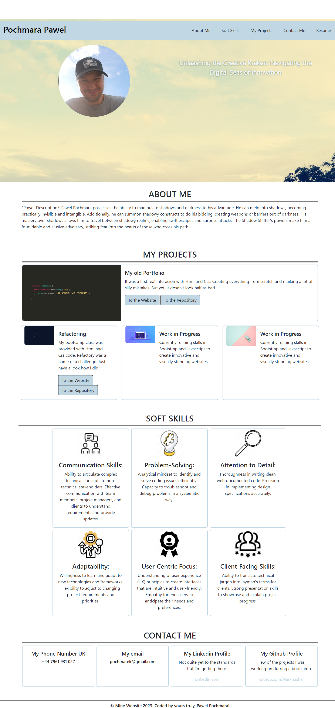
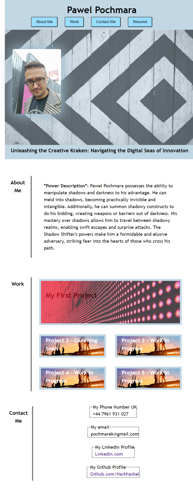

# Bootstrap-Portfolio

## Description 

It fianlly starts to feel like I understand what I'm doing. More or less. This week bring us a Bootsrap - Css framework. 

Task is to use Bootsratp to recreate our previous portfolio which we only used Css to style. 

### [Link to New Portfolio.](https://narkhashel.github.io/Bootstrap-Portfolio/#skills)

### Here is a list of Acceptance Criteria:

Using Bootstrap, recreate your portfolio site with the following items:

* A navigation bar
* A navigation menu at the top. Feel free to use the navbar code provided in Bootstrap's documentation, or create your own navbar by applying the correct Bootstrap classes to your HTML.
* Include links that are applicable to your portfolio.
* Links should navigate to the appropriate sections

#### A hero section

* A jumbotron featuring your picture, your name, and any other information you'd like to include.
  
#### A work section

* A section displaying your work in grid.
* If you need to use placeholder image use placehold.coLinks to an external site.
* Use Bootstrap cards for each project.
* The description should give a brief overview of the work.
* Each project will eventually link to your class project work!

#### A skills section

* List out the skills you expect to learn from the bootcamp.
* All hyperlinks should have a hover effect.
* All buttons should display a box shadow upon hover.
* Your Bootstrap solution should minimize use of media queries.
* Deploy your new Bootstrap-powered portfolio to GitHub Pages.

### [Old Portfolio](https://narkhashel.github.io/Pawel-Pochmara-Portfolio/)

## Installation

N/A

## Credits

I mostly used:

* [Bootstrap](https://getbootstrap.com/docs/5.3/getting-started/introduction/) main website
* [Youtube](https://www.youtube.com/watch?v=-qfEOE4vtxE) Full course for Beginers on Bootstrap

## License

MIT License
